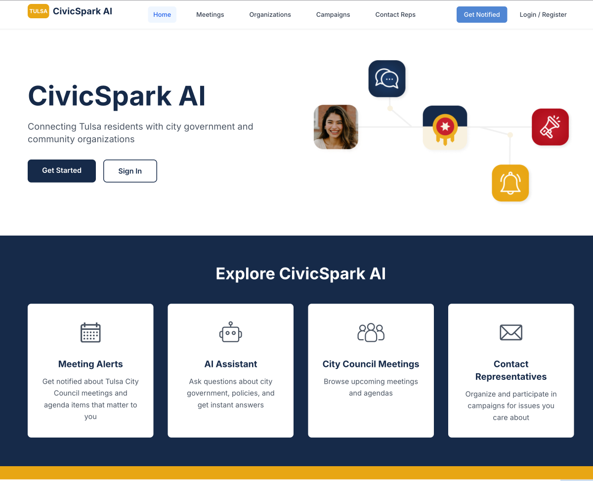
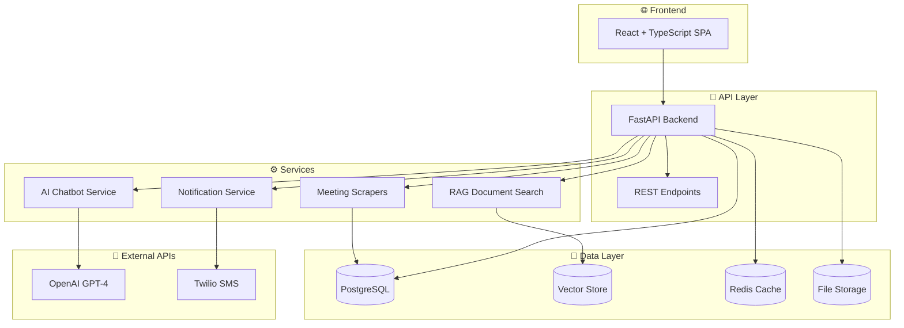

# 🏛️ CivicSpark AI - Tulsa Civic Engagement Platform

A comprehensive CivicTech platform connecting Tulsa residents with city government through AI-powered tools, automated notifications, and intelligent meeting analytics.

## 📊 Project Status & Info

[](https://d1s9nkkr0t3pmn.cloudfront.net)
[](https://github.com/kaizengrowth/CityCamp_AI)
[](LICENSE)

[](https://github.com/kaizengrowth/CityCamp_AI/commits/main)
[](https://github.com/kaizengrowth/CityCamp_AI/issues)
[](https://github.com/kaizengrowth/CityCamp_AI/stargazers)

[](#-architecture)
[](https://github.com/kaizengrowth/CityCamp_AI)
[](#-system-status--health)
[](CONTRIBUTING.md)

> **🌐 Deployed Demo**: [https://d1s9nkkr0t3pmn.cloudfront.net](https://d1s9nkkr0t3pmn.cloudfront.net)



## 🌟 Features

### 🤖 **AI-Powered Civic Assistant**
- Interactive chatbot with real-time city council knowledge
- **RAG-Enhanced Responses**: Document-based answers using city budgets, legislation, and policies
- Natural language queries about Tulsa government with contextual document search
- Meeting summary generation and analysis

### 📅 **Smart Meeting Notifications**
- Automated alerts for city council meetings
- Topic-based subscriptions (housing, transportation, etc.)
- SMS and email delivery with AI-categorized content

### 📊 **Intelligent Meeting Analytics**
- AI categorization of 42+ civic topics
- Automated agenda extraction and impact assessment
- Searchable meeting minutes with keyword analysis

### 💬 **Representative Communication**
- AI-powered email generation to contact officials
- District-based representative lookup
- Pre-built templates for common civic issues

### 🗳️ **Community Engagement**
- Campaign tracking and petition management
- Neighborhood-based organizing tools
- User preference and notification management

## 📄 **RAG System (Retrieval-Augmented Generation)**

### **🎯 What is RAG?**
The RAG system enables the chatbot to search and reference actual city documents, budgets, legislation, and policies to provide accurate, source-backed answers instead of generic responses.

### **🔧 Key Components**
- **Vector Database**: ChromaDB (dev) / FAISS (production) for semantic search
- **Document Processing**: AI-powered text extraction, chunking, and summarization
- **Embedding Generation**: OpenAI text-embedding-3-small for vector representations
- **Smart Search**: Contextual document retrieval with relevance scoring

### **📁 Supported Document Types**
- 💰 **Budgets**: City financial documents and allocations
- 📜 **Legislation**: Ordinances, resolutions, and policies
- 📋 **Meeting Minutes**: City council and committee records
- 📊 **Reports**: Studies, analyses, and official reports
- 📝 **Policies**: Administrative procedures and guidelines

### **🚀 Quick RAG Setup**
```bash
# Install RAG dependencies
pip install -r backend/requirements.txt

# Run database migration
cd backend && python -m alembic upgrade head

# Test the system
python scripts/test_rag_system.py
```

**📖 Full Documentation**: See [`docs/RAG_SYSTEM_README.md`](docs/RAG_SYSTEM_README.md)

## 🧪 **LLM-as-Judge Evaluation System**

### **🎯 Intelligent Chatbot Testing**
Advanced evaluation framework using GPT-4 to assess chatbot response quality beyond traditional keyword matching.

### **🔧 Key Features**
- **Smart Quality Assessment**: GPT-4 evaluates helpfulness, accuracy, and civic appropriateness
- **Semantic Understanding**: Goes beyond keywords to understand context and meaning
- **Comparative Analysis**: Traditional metrics vs. LLM evaluation with combined scoring
- **Actionable Feedback**: Specific improvement suggestions and response strengths

### **📊 Evaluation Metrics**
- **Accuracy**: Factual correctness and Tulsa civic relevance
- **Helpfulness**: How well responses assist users with civic questions
- **Completeness**: Information sufficiency without verbosity
- **Civic Appropriateness**: Tone and context suitability for government use

### **🚀 Quick Evaluation**
```bash
# LLM-as-Judge evaluation
python scripts/run_eval.py --mode llm-judge

# Compare traditional vs LLM metrics
python scripts/llm_judge_evaluator.py

# Performance benchmarking
python scripts/run_eval.py --mode performance
```

### **📈 Sample Results**
```
LLM-AS-JUDGE EVALUATION SUMMARY
Combined Score: 0.847/1.0 (Grade: B)
Traditional Score: 0.789/1.0
LLM Judge Score: 0.873/1.0
Score Improvement: +0.084

Grade Distribution: A: 2, B: 6, C: 2, D: 0, F: 0
```

**📖 Full Documentation**: See [`docs/CHATBOT_EVALUATION_README.md`](docs/CHATBOT_EVALUATION_README.md)

## 🚀 Quick Start

### **Local Development**
```bash
# Clone repository
git clone https://github.com/kaizengrowth/CityCamp_AI.git
cd CityCamp_AI

# Option 1: Automated setup (recommended)
./scripts/start-dev.sh

# Option 2: Manual setup
# Backend
cd backend
python -m venv venv && source venv/bin/activate
pip install -r requirements.txt
cp env.example .env
python -m app.main

# Frontend (new terminal)
cd frontend
npm install
npm run dev
```

**Access Points:**
- 🎨 **Frontend**: http://localhost:3007
- ⚙️ **Backend API**: http://localhost:8000
- 📚 **API Docs**: http://localhost:8000/docs

### **Production Access**
- 🌐 **Live Application**: https://d1s9nkkr0t3pmn.cloudfront.net
- 📊 **AWS Console**: [ECS Services](https://console.aws.amazon.com/ecs/)

## 🏗️ Architecture

### **Technology Stack**
- **Frontend**: React 18 + TypeScript + Vite + Tailwind CSS
- **Backend**: FastAPI + Python 3.11 + PostgreSQL + Redis
- **AI/ML**: OpenAI GPT-4 + Custom categorization models + **RAG System (ChromaDB/FAISS)**
- **Document Processing**: Multi-format support (PDF, DOCX, TXT) with vector embeddings
- **Evaluation**: **LLM-as-Judge system** with GPT-4 intelligent response assessment
- **Infrastructure**: AWS (ECS Fargate, RDS, ElastiCache, S3, CloudFront)
- **CI/CD**: GitHub Actions with automated testing and deployment

### **Comprehensive System Architecture**

The application follows a **layered architecture** with clear separation of concerns, dependency injection, and standardized patterns across all components.

#### **📊 System Architecture Overview**



**🎯 Key Architecture Components:**
- **Frontend**: React 18 SPA with TypeScript for type safety
- **API Layer**: FastAPI with standardized responses and error handling
- **AI Services**: GPT-4 chatbot with RAG document search capabilities
- **Data Storage**: PostgreSQL + Vector store + Redis caching + S3 files
- **External Integrations**: OpenAI for AI, Twilio for SMS notifications

#### **🔧 Key Architectural Patterns**

- **Dependency Injection**: Services use constructor injection for better testability
- **Base Service Pattern**: All services inherit from `BaseService` for consistency
- **Standardized Responses**: Unified API response formats with proper error handling
- **Unified Data Models**: Consolidated notification preferences and user management
- **RAG Architecture**: Document processing with vector embeddings for semantic search
- **Event-Driven Notifications**: Async notification processing with queue management

#### **📊 Detailed Service Dependencies**

```mermaid
graph TB
    subgraph "🌐 Frontend Layer"
        FE[React 18 + TypeScript SPA]
        FE_COMP[Components Layer]
        FE_PAGES[Pages Layer]
        FE_CTX[Contexts Layer]
        FE_API[API Config]

        FE --> FE_COMP
        FE --> FE_PAGES
        FE --> FE_CTX
        FE --> FE_API
    end

    subgraph "🔌 API Gateway Layer"
        CF[CloudFront CDN]
        ALB[Application Load Balancer]
        CORS[CORS Middleware]

        CF --> ALB
        ALB --> CORS
    end

    subgraph "🚀 FastAPI Application"
        MAIN[main.py - App Entry]
        ROUTER[API Router v1]
        MIDDLEWARE[Middleware Stack]
        EXCEPTION[Exception Handlers]

        MAIN --> ROUTER
        MAIN --> MIDDLEWARE
        MAIN --> EXCEPTION
    end

    subgraph "📡 API Endpoints"
        EP_AUTH[Auth Endpoints]
        EP_MEET[Meetings Endpoints]
        EP_ORG[Organizations Endpoints]
        EP_CAMP[Campaigns Endpoints]
        EP_CHAT[Chatbot Endpoints]
        EP_DOC[Documents Endpoints]
        EP_SUB[Subscriptions Endpoints]
        EP_REP[Representatives Endpoints]

        ROUTER --> EP_AUTH
        ROUTER --> EP_MEET
        ROUTER --> EP_ORG
        ROUTER --> EP_CAMP
        ROUTER --> EP_CHAT
        ROUTER --> EP_DOC
        ROUTER --> EP_SUB
        ROUTER --> EP_REP
    end

    subgraph "⚙️ Service Layer"
        BASE_SVC[BaseService Abstract Class]
        CHAT_SVC[ChatbotService]
        DOC_SVC[DocumentProcessingService]
        VEC_SVC[VectorService]
        NOTIF_SVC[NotificationService]
        TWILIO_SVC[TwilioService]
        S3_SVC[S3Service]
        GEO_SVC[GeocodingService]
        AUTH_SVC[AuthService]
        RESEARCH_SVC[ResearchService]

        BASE_SVC -.-> CHAT_SVC
        BASE_SVC -.-> DOC_SVC
        BASE_SVC -.-> VEC_SVC
        BASE_SVC -.-> NOTIF_SVC
        BASE_SVC -.-> TWILIO_SVC
        BASE_SVC -.-> S3_SVC
        BASE_SVC -.-> GEO_SVC
        BASE_SVC -.-> RESEARCH_SVC

        CHAT_SVC --> VEC_SVC
        CHAT_SVC --> RESEARCH_SVC
        DOC_SVC --> VEC_SVC
        NOTIF_SVC --> TWILIO_SVC
    end

    subgraph "🗄️ Data Models Layer"
        USER_MODEL[User Model]
        MEET_MODEL[Meeting Model]
        ORG_MODEL[Organization Model]
        CAMP_MODEL[Campaign Model]
        DOC_MODEL[Document Model]
        NOTIF_PREF[NotificationPreferences Model]
        SUB_MODEL[Subscription Models]

        NOTIF_PREF --> USER_MODEL
    end

    subgraph "💾 Data Storage Layer"
        POSTGRES[(PostgreSQL Database)]
        REDIS[(Redis Cache)]
        CHROMA[(ChromaDB Vector Store)]
        FAISS[(FAISS Vector Index)]
        S3[(AWS S3 Storage)]

        VEC_SVC --> CHROMA
        VEC_SVC --> FAISS
        S3_SVC --> S3
    end

    subgraph "🤖 AI & External Services"
        OPENAI[OpenAI GPT-4 API]
        EMBEDDING[OpenAI Embeddings]
        TWILIO_API[Twilio SMS API]
        GOOGLE_API[Google Search API]
        GEOCODING[Geocoding APIs]

        CHAT_SVC --> OPENAI
        VEC_SVC --> EMBEDDING
        TWILIO_SVC --> TWILIO_API
        RESEARCH_SVC --> GOOGLE_API
        GEO_SVC --> GEOCODING
    end

    subgraph "🔍 Data Collection"
        SCRAPERS[Meeting Scrapers]
        TGOV_SCRAPER[TGOV Scraper]
        ARCHIVE_SCRAPER[Archive Scraper]

        SCRAPERS --> TGOV_SCRAPER
        SCRAPERS --> ARCHIVE_SCRAPER
    end

    subgraph "☁️ AWS Infrastructure"
        ECS[ECS Fargate]
        RDS[RDS PostgreSQL]
        ELASTICACHE[ElastiCache Redis]
        CLOUDFRONT[CloudFront CDN]

        ECS --> RDS
        ECS --> ELASTICACHE
        CLOUDFRONT --> ECS
    end

    subgraph "📊 Response Standardization"
        STD_LIST[StandardListResponse]
        STD_RESP[StandardResponse]
        ERR_RESP[ErrorResponse]
        PAGINATION[PaginationParams]

        EP_MEET --> STD_LIST
        EP_ORG --> STD_LIST
        EP_CAMP --> STD_LIST
        EP_DOC --> STD_LIST
    end

    %% Connections
    FE_API --> CF
    CF --> MAIN

    EP_AUTH --> AUTH_SVC
    EP_MEET --> CHAT_SVC
    EP_ORG --> BASE_SVC
    EP_CAMP --> BASE_SVC
    EP_CHAT --> CHAT_SVC
    EP_DOC --> DOC_SVC
    EP_SUB --> NOTIF_SVC

    USER_MODEL --> POSTGRES
    MEET_MODEL --> POSTGRES
    ORG_MODEL --> POSTGRES
    CAMP_MODEL --> POSTGRES
    DOC_MODEL --> POSTGRES
    NOTIF_PREF --> POSTGRES
    SUB_MODEL --> POSTGRES

    SCRAPERS --> MEET_MODEL

    POSTGRES --> RDS
    REDIS --> ELASTICACHE
    S3 --> S3
    CF --> CLOUDFRONT
```



#### **🎯 Architectural Principles**

- **Single Responsibility**: Each service has a focused, well-defined purpose
- **Dependency Inversion**: High-level modules don't depend on low-level modules
- **Interface Segregation**: Clients depend only on interfaces they use
- **Open/Closed**: Open for extension, closed for modification
- **DRY (Don't Repeat Yourself)**: Shared functionality in base classes
- **Consistent Error Handling**: Standardized exception handling across all layers
- **Type Safety**: Full TypeScript and Python type coverage

#### **🔄 Recent Architectural Improvements**

The codebase has been significantly refactored to improve maintainability and consistency:

**✅ Standardization Improvements:**
- **Unified Response Format**: All API endpoints now use `StandardListResponse` and `PaginationParams`
- **Base Service Pattern**: All services inherit from `BaseService` with dependency injection
- **Centralized Error Handling**: Custom exception classes with structured error responses
- **Unified Notification System**: Consolidated user and subscription notification preferences

**✅ Code Quality Improvements:**
- **Reduced Duplication**: Eliminated ~200 lines of redundant code
- **Better Type Safety**: Full type coverage with generic response types
- **Improved Testability**: Dependency injection enables easier mocking
- **Consistent Logging**: Standardized logging patterns across all services

**✅ Database Improvements:**
- **Unified Models**: `NotificationPreferences` model consolidates user notification settings
- **Proper Migrations**: Alembic migrations preserve existing data during schema changes
- **Better Relationships**: Cleaner model relationships with proper foreign keys

See [`docs/ARCHITECTURE_IMPROVEMENTS.md`](docs/ARCHITECTURE_IMPROVEMENTS.md) for detailed implementation notes.

## 📁 Project Structure

```
CityCamp_AI/
├── 🎨 frontend/              # React TypeScript application
│   ├── src/
│   │   ├── components/       # React components
│   │   ├── pages/           # Route components
│   │   ├── contexts/        # React contexts
│   │   └── config/          # API configuration
│   ├── package.json         # Dependencies
│   └── vite.config.ts       # Vite configuration
│
├── ⚙️ backend/               # FastAPI Python backend
│   ├── app/
│   │   ├── api/v1/          # API endpoints with standardized responses
│   │   │   └── endpoints/   # Individual endpoint modules
│   │   ├── core/            # Core application components
│   │   │   ├── config.py    # Application configuration
│   │   │   ├── database.py  # Database connection and setup
│   │   │   └── exceptions.py # Custom exception handling
│   │   ├── models/          # SQLAlchemy database models
│   │   │   ├── user.py      # User and authentication models
│   │   │   ├── meeting.py   # Meeting and agenda models
│   │   │   ├── organization.py # Community organization models
│   │   │   ├── campaign.py  # Civic campaign models
│   │   │   ├── document.py  # RAG document models
│   │   │   └── notification_preferences.py # Unified notification system
│   │   ├── schemas/         # Pydantic schemas for API
│   │   │   ├── base.py      # Standardized response schemas
│   │   │   └── *.py         # Individual endpoint schemas
│   │   ├── services/        # Business logic layer
│   │   │   ├── base.py      # BaseService abstract class
│   │   │   ├── chatbot_service.py # AI chatbot with RAG
│   │   │   ├── vector_service.py  # Vector embeddings and search
│   │   │   ├── document_processing_service.py # Document processing
│   │   │   ├── notification_service.py # Meeting notifications
│   │   │   └── *.py         # Other specialized services
│   │   └── scrapers/        # Data collection modules
│   ├── alembic/            # Database migrations
│   ├── requirements.txt     # Python dependencies
│   └── main.py             # Application entry point with exception handlers
│
├── ☁️ aws/                   # Infrastructure as Code
│   ├── terraform/           # Terraform configurations
│   ├── scripts/             # Deployment scripts
│   └── README.md           # AWS deployment guide
│
├── 📚 docs/                  # Comprehensive documentation
│   ├── QUICKSTART.md        # 5-minute setup guide
│   ├── RAG_SYSTEM_README.md # RAG architecture & usage guide
│   ├── CHATBOT_EVALUATION_README.md # LLM-as-Judge evaluation guide
│   ├── ARCHITECTURE_IMPROVEMENTS.md # Recent refactoring details
│   ├── aws-deployment-guide.md
│   ├── TROUBLESHOOTING.md   # Issue resolution
│   └── API_DOCUMENTATION.md # API reference
│
├── 🧪 tests/                 # Centralized testing
│   ├── backend/             # Python API tests
│   ├── frontend/            # React component tests
│   └── README.md           # Testing instructions
│
└── 🔧 scripts/               # Development & deployment
    ├── start-dev.sh         # Local development setup
    ├── eval_chatbot_system.py # Traditional evaluation system
    ├── llm_judge_evaluator.py # LLM-as-Judge evaluation
    ├── run_eval.py          # Evaluation runner with multiple modes
    ├── test_rag_system.py   # RAG system testing
    ├── test_production_api.sh # Production diagnostics
    └── fix_production_api.sh  # Production issue fixes
```

## 🔧 Development

### **Environment Setup**
```bash
# Check requirements
node --version  # >= 18.0.0
python --version # >= 3.11.0
docker --version # Latest

# Setup with automation
./scripts/start-dev.sh

# Manual database setup (if needed)
./scripts/setup_database.py
```

### **Key Development Commands**
```bash
# Frontend
cd frontend
npm run dev          # Start development server
npm run build        # Build for production
npm run test         # Run component tests
npm run lint         # Code linting

# Backend
cd backend
source venv/bin/activate
python -m app.main   # Start development server
python -m pytest ../tests/backend/ -v  # Run API tests
python -m app.services.meeting_scraper  # Live meeting discovery

# Full system
./scripts/start-dev.sh     # Start all services
./scripts/test-all.sh      # Run all tests
```

## 🚀 Production Deployment

### **Automated Deployment**
```bash
# Deploy to AWS (requires AWS CLI configured)
./aws/scripts/deploy.sh

# Check production health
./scripts/test_production_api.sh

# Fix production issues
./scripts/fix_production_api.sh
```

### **Manual Deployment Steps**
1. **Infrastructure**: Deploy with Terraform (`aws/terraform/`)
2. **Backend**: ECS Fargate service with auto-scaling
3. **Frontend**: S3 + CloudFront distribution
4. **Database**: RDS PostgreSQL with automated backups
5. **Monitoring**: CloudWatch logs and alerts

## 📊 System Status & Health

### **Performance Metrics**
- 📈 **API Response Time**: < 500ms average
- 📊 **Database**: 40+ meetings with full AI categorization
- 🔄 **Uptime**: 99%+ availability
- 💾 **Data**: AI-processed meeting minutes and agenda items

## 🧪 Testing

### **Run All Tests**
```bash
# Automated testing
npm run test           # Frontend unit tests
python -m pytest tests/backend/ -v  # Backend API tests

# Manual testing
./scripts/test_production_api.sh  # Production diagnostics
curl http://localhost:8000/health # Health checks
```

### **Test Coverage**
- ✅ **API Endpoints**: All CRUD operations
- ✅ **Database Models**: Meeting, User, Notification schemas
- ✅ **AI Services**: Text extraction and categorization
- ✅ **Frontend Components**: Key UI components
- ✅ **Production Health**: End-to-end API testing

## 🛠️ Troubleshooting

### **Common Issues & Quick Fixes**

**Meeting Details Not Loading:**
```bash
./scripts/fix_production_api.sh  # Automated fix
```

**Backend Won't Start:**
```bash
lsof -ti:8000 | xargs kill -9  # Kill conflicting processes
cd backend && source venv/bin/activate && python -m app.main
```

**Frontend Dependencies Issues:**
```bash
cd frontend && rm -rf node_modules package-lock.json && npm install
```

**Production API Issues:**
```bash
./scripts/test_production_api.sh  # Diagnose issues
./scripts/fix_production_api.sh   # Apply fixes
```

**More solutions**: See [`docs/TROUBLESHOOTING.md`](docs/TROUBLESHOOTING.md)

## 📚 Documentation

### **Getting Started**
- 🚀 **[Quick Start Guide](docs/QUICKSTART.md)** - 5-minute setup
- 🔧 **[Environment Setup](docs/ENVIRONMENT_SETUP.md)** - Detailed configuration
- 🧪 **[Testing Guide](tests/README.md)** - Testing procedures

### **Deployment & Operations**
- ☁️ **[AWS Deployment](docs/aws-deployment-guide.md)** - Production setup
- 🔄 **[CI/CD Setup](docs/GITHUB_ACTIONS_SETUP.md)** - Automated workflows
- 🛡️ **[Security Guide](docs/TROUBLESHOOTING.md#security)** - Security best practices

### **API & Development**
- 📖 **[API Documentation](http://localhost:8000/docs)** - Interactive API docs
- 🤖 **[Chatbot Guide](docs/ENHANCED_CHATBOT_GUIDE.md)** - AI assistant setup
- 📄 **[RAG System Guide](docs/RAG_SYSTEM_README.md)** - Document processing & vector search
- 🧪 **[Evaluation System Guide](docs/CHATBOT_EVALUATION_README.md)** - LLM-as-Judge testing framework
- 🔧 **[Scraper Documentation](docs/SCRAPER_TEST_README.md)** - Meeting discovery & PDF import

## 🤝 Contributing

### **Development Workflow**
1. **Fork** the repository
2. **Clone** your fork: `git clone https://github.com/YOUR_USERNAME/CityCamp_AI.git`
3. **Setup**: Run `./scripts/start-dev.sh`
4. **Develop**: Make changes and test locally
5. **Test**: Run `npm test` and `python -m pytest tests/backend/ -v`
6. **Submit**: Create pull request

### **Code Standards**
- ✅ **TypeScript**: Strict mode enabled
- ✅ **Python**: Type hints and docstrings
- ✅ **Testing**: Unit tests for new features
- ✅ **Linting**: Pre-commit hooks configured
- ✅ **Documentation**: Update README for new features

## 📊 Monitoring & Analytics

### **Production Monitoring**
- 📈 **CloudWatch**: Application and infrastructure metrics
- 🔍 **Logs**: Centralized logging with search capabilities
- 🚨 **Alerts**: Automated notifications for issues
- 📊 **Dashboard**: Real-time system health metrics

### **Key Metrics**
- 🌐 **Web Traffic**: CloudFront analytics
- 📱 **API Usage**: Request volume and response times
- 💾 **Database**: Query performance and connection health
- 🤖 **AI Services**: API usage and categorization accuracy

## 🔐 Security

### **Security Features**
- 🛡️ **HTTPS**: All communication encrypted
- 🔐 **Environment Variables**: Secrets management
- 🏗️ **VPC**: Network isolation in AWS
- 👤 **IAM**: Minimal permission roles
- 🔍 **Security Scanning**: Automated vulnerability checks

### **Data Protection**
- 📊 **Database Encryption**: At rest and in transit
- 🔒 **API Authentication**: JWT tokens
- 🛡️ **Input Validation**: XSS and injection prevention
- 📋 **Audit Logs**: Comprehensive activity tracking

## 📄 License

MIT License - see [LICENSE](LICENSE) file for details.

## 🆘 Support

### **Get Help**
- 📚 **Documentation**: Check [`docs/`](docs/) directory
- 🐛 **Issues**: Create GitHub issue with details
- 💬 **Discussions**: Use GitHub Discussions for questions
- 🛠️ **Emergency**: Run `./scripts/fix_production_api.sh` for production issues

### **Contact**
- 📧 **Email**: kaitlin.cort@owasp.org
- 🐙 **GitHub**: [@kaizengrowth](https://github.com/kaizengrowth)

---

## 📈 Recent Updates

**RAG System & Evaluation Architecture Changes** (August 5, 2025):
- ✅ **Implemented LLM-as-Judge evaluation system** using GPT-4 for intelligent response assessment
- ✅ **Comprehensive RAG system** for document-based chatbot responses with vector search
- ✅ Added advanced evaluation framework with traditional + LLM metrics comparison
- ✅ Created document processing pipeline with multi-format support (PDF, DOCX, TXT)
- ✅ Integrated RAG into existing chatbot with OpenAI function calling
- ✅ Added complete document management API with upload/search endpoints
- ✅ Built evaluation suite with multiple modes (quick, full, RAG, performance, LLM-judge)
- ✅ Fixed production meeting details loading issues
- ✅ Added comprehensive production troubleshooting scripts
- ✅ Resolved security vulnerabilities (esbuild, dependencies)
- ✅ Enhanced CI/CD pipeline with automated testing
- ✅ Updated documentation and README files

**Next Planned Features**:
- 📄 **RAG System Expansion**: Upload city budgets, ordinances, and legislation
- 🔍 **Advanced Document Search**: Semantic search across all city documents
- 🧪 **Evaluation System Enhancement**: A/B testing, user satisfaction metrics, continuous monitoring
- 🤖 **Multi-Judge Evaluation**: Compare GPT-4 vs Claude vs other LLMs as judges
- 🔄 Enhanced meeting data scraping automation
- 📱 Mobile app development
- 🤖 Advanced AI categorization improvements
- 📊 User analytics dashboard

---

**Ready to get started?** Follow the [Quick Start Guide](docs/QUICKSTART.md) or run `./scripts/start-dev.sh`! 🚀
